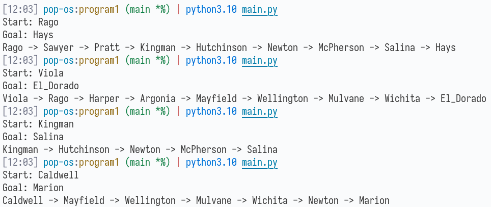

# Overview

This is a simple implementation of A* for my Intro to AI course.

The `Adjacencies-custom.txt` file has a couple changes to make more intuitive paths. Turns out Viola is kind of a choke point for a lot of towns in that area. It doesn't matter for the assignment, but it helped me gut check that unintuitive paths weren't an actual error in my script.

# Usage

